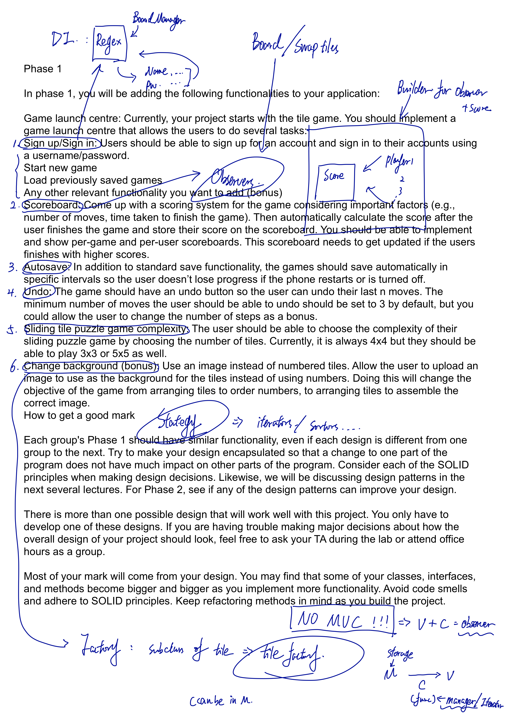
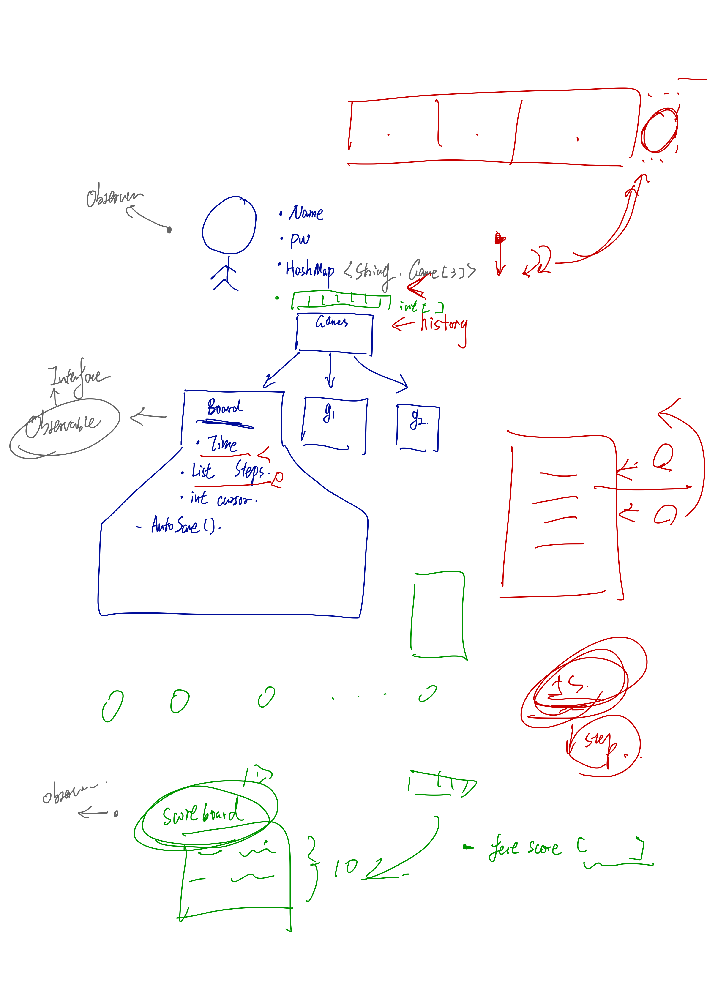
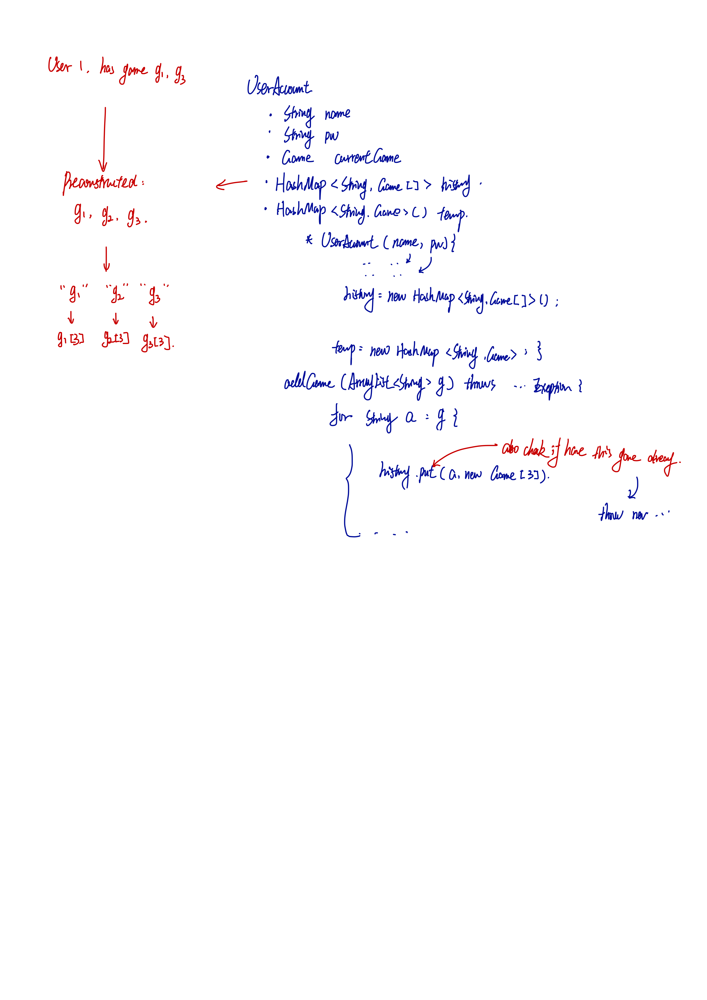
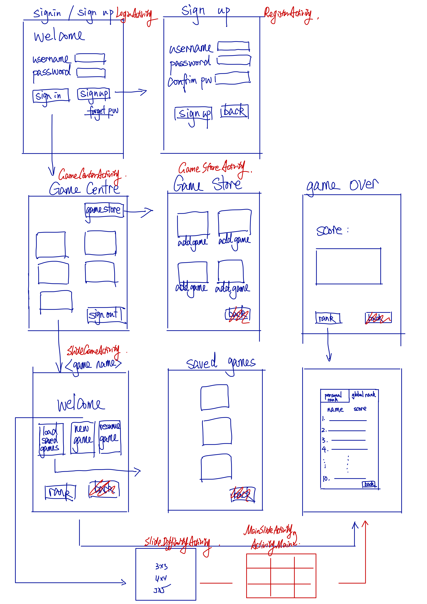
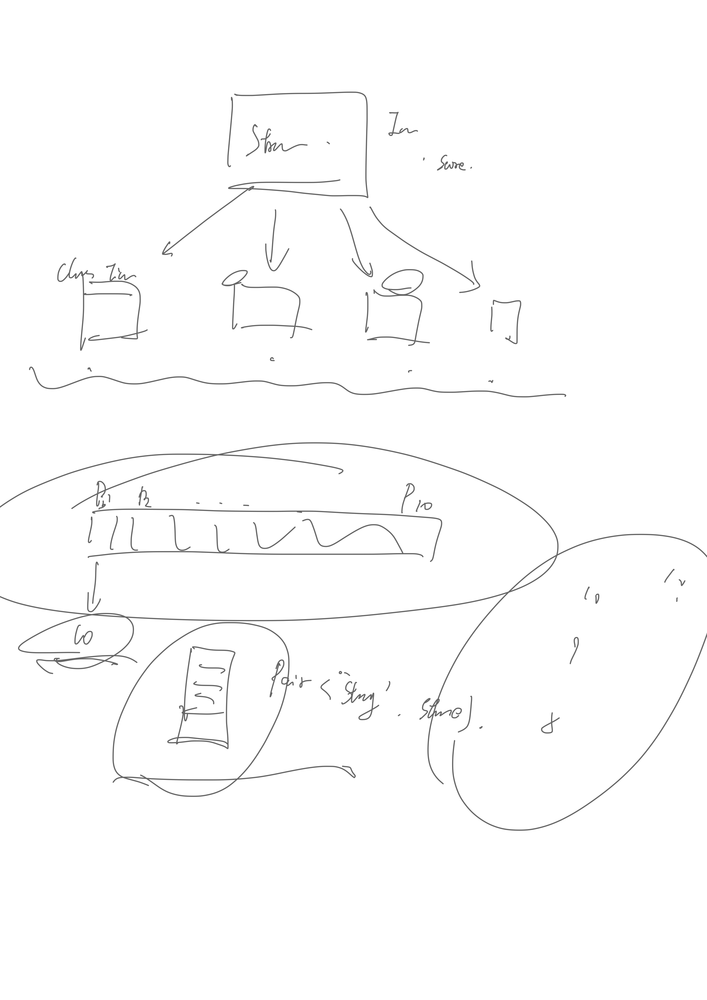
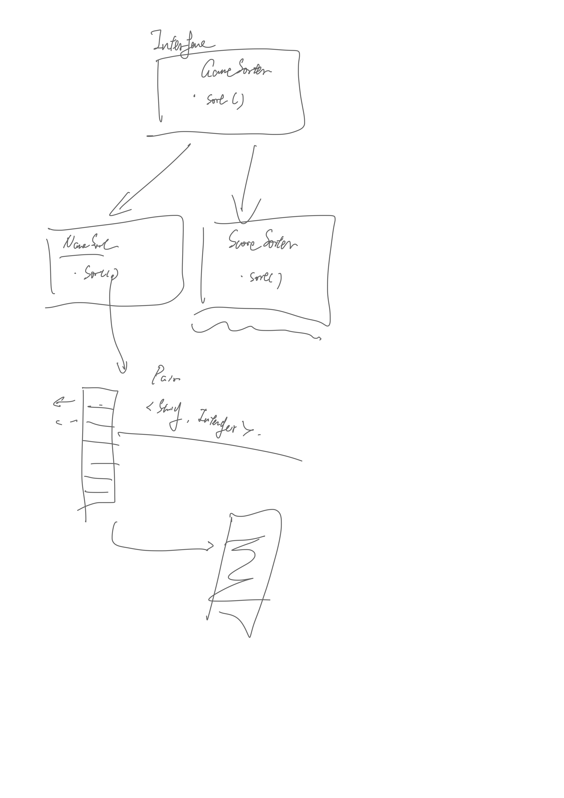

# Contact Information:
| Name        | Email           | Tele  |
| ------------- |:-------------:| -----:|
| Binwei (Frank) Chen | frankbw.chen@mail.utoronto.ca | $1600 |
| Haoyan (Max) Jiang | haoyanhy.jiang@mail.utoronto.ca |437-987-5544|
| Xinyi (Lucia) Zhang | luciaxinyi.zhang@mail.utoronto.ca  | 905-616-5876|
|Yi (Summer) Tao| summer.tao@mail.utoronto.ca |647-987-6600|
|Chenjie (Johnson) Zhao|johnson.zhao@mail.utoronto.ca|647-980-8714|

# Communication Tools:
wechat

# Team Contract:
I will finish my task on time.
I will contribute my idea and actively discuss with my teammate.
I will be polite to my teammates.
I will find my teammates and talk to them once I find a problem.
I will do my best.

# Team Rules:
Meeting regularly, updating progress and discuss further actions
Working individually and seperately.

# Meeting Notes:

## Notes: Reading through handout, trying to figure out project structure with criteria and requirement,
## optimize all functionality with proposed possible structure.
## using factory design pattern and MVC design pattern to implement existing A2 code
## using self-implemented observer design pattern to interact users with board
## need further working on the UI controls with better understanding of Android system.

details: no code implementations

## Notes: Trying to solve memory system of the game:
### 1. three static memory for 3x3, 4x4, 5x5 slide board game, accessed through load game button
### 2. one temporary memory for system unexpected shut down, accessed by resume button and processed by auto-save
### 3. each time exit a game, system will ask if save the game or discard; if save, temp memory will be erased,
### corresponding static memory will be override. if dismissed, temp will be erased as well, current memory got discard.
## include unlimited amount of redo and undo step, with implementation of linked-list (self implemented)
## login system, scoreboard system (personal score board and global scoreboard

details: ready for coding, with CRC cards

## Notes: Details of memory management, using hashmap to save the whole BoardManager class, with time, history and board
implement backend skeleton, finished till next meeting

Details:
Summer: UserAccount, UserAccountManager
Max: UI and controllers
Johnson: ScoreBoard, Strategy (and classes implements it)
Lucia: Sorter (and classes and algorithm)
Frank: HistoryNode, History,BoardManager, Board

## UI design structure (tempted)

Details:
Max: finishes all the UI skeleton and connection to back-end
Others: mid-term

## Using sorter and strategy to manage score and score board so that score can be sorted in different ways (details)
### time
### user
### score rank
### ...
## and score can be calculated in different approaches
## make score and user info stores in ArrayList and in Pairs

Details:
Johnson: finish scoreboard to UI
Frank: game memory debugging
Summer: UI design
Max: code smell + design pattern, markdown summary
Lucia: absent

# Nov.6th
Details:
Johnson: making global scoreboard
Frank: implementing strategy design pattern, javadoc
Summer: UI beautifying, score board UI redesign
Max: code smell, debugging, markdown summary, javadoc
Lucia: absent
